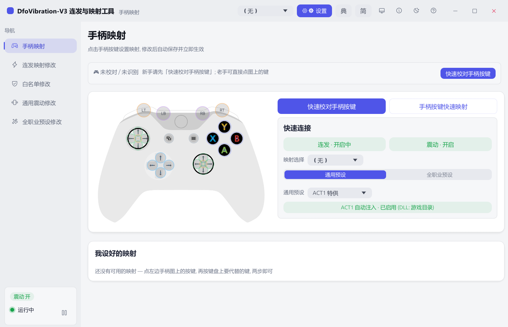
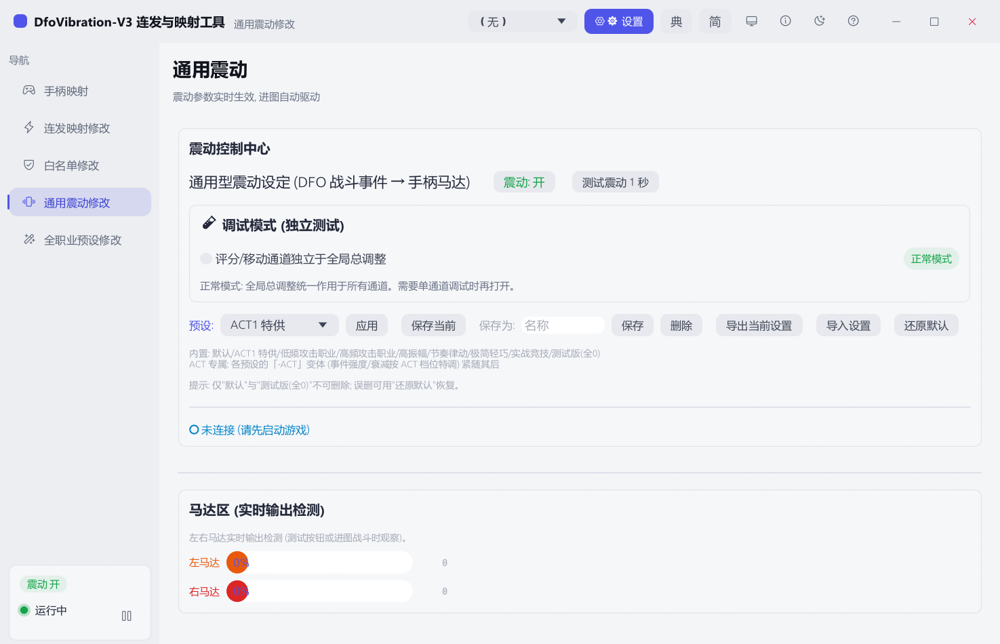
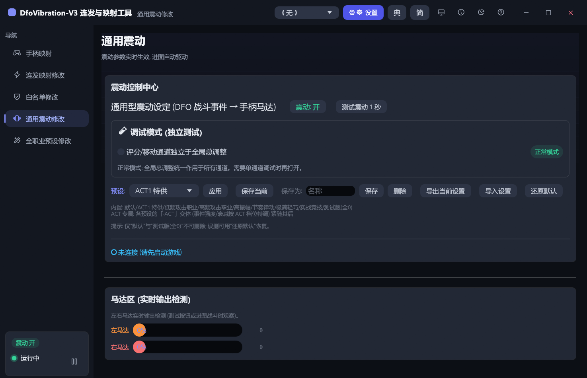
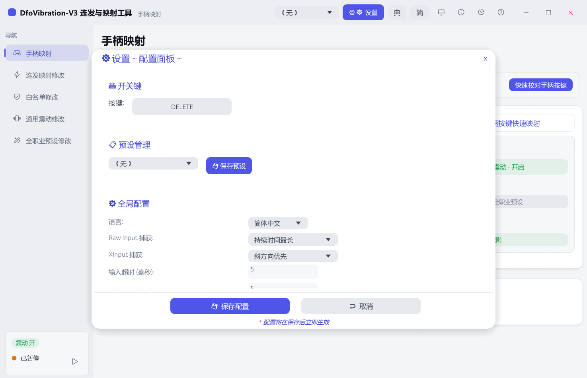
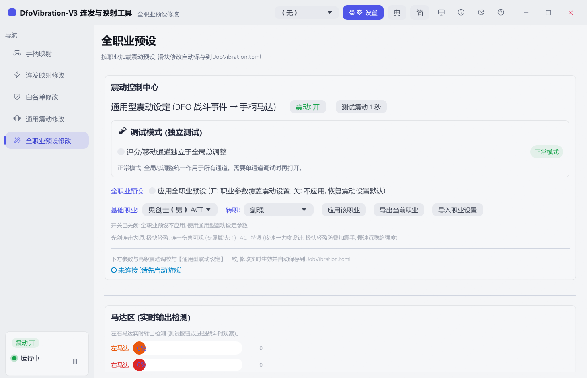

# DfoVibration-V3 — DNF 手柄连发 + 战斗震动工具

**把手柄真正用进 DNF**：手柄按键 → 键盘/鼠标映射（连发），游戏内战斗事件实时驱动手柄震动（伤害、评分、受击、走位……全部有感）。

> 基于开源项目 [Sorahk](https://github.com/llnut/Sorahk) 深度二次开发 · 单文件 exe · 绿色免安装 · 明暗双主题

| 手柄映射（即点即用） | 通用震动（战斗事件 → 马达） |
|---|---|
|  |  |

## 它能做什么

- **🎮 手柄映射**：点手柄图上的按键 → 再按目标键，两步完成绑定；已配置按键直接列在下方，点击即可改
- **⚡ 连发**：键盘 / 鼠标 / 手柄键做成连发，间隔时长可调；支持组合键、双击、奔跑三区摇杆
- **📳 通用震动**：伤害飘字 / 命中 / 评分 / 怪物死亡等战斗事件实时驱动左右马达，60 项参数全部可调，内置 ACT1 特供等预设
- **🧙 全职业预设**：39 个职业专属震动方案（近战 / 远程 / 法师节奏各自特调），一键应用
- **🛡 白名单**：只在指定游戏进程里生效，桌面 / 其他软件不受任何影响
- **🌙 暗色主题 · 极简模式 · 托盘常驻**：小窗挂机只留连发 / 震动两个开关，关窗不退出

## 快速上手（5 步）

1. **解压**发行包到任意目录（路径建议不含特殊字符）
2. **右键「以管理员身份运行」** `DfoVibration-Sorahk.exe`（90CN 新版客户端必须管理员，否则注入被拒）
3. 首次启动按向导选择：是否 DFO 玩家 → 游戏版本（S1 老版本 / S4 新版本）→ 完成
4. 插上手柄 → 手柄映射页点「**快速校对手柄按键**」，按提示按几个键完成识别
5. 点手柄图上的按键绑定目标键；切到「通用震动」页开震动 → **进图打怪，手柄会替你感受战斗**

> 第三方手柄连不上？先点「设置 ⚙ 旁的手柄图标 → 重置手柄」；非 XInput 手柄在映射页按任意键即可走 Raw Input 激活。

## 各客户端对应的注入 DLL

宿主**自动注入**：在设置里登记游戏目录后，启动游戏时会自动把对应 DLL 注入，无需手动放置（也可手动复制到游戏的 `us_extend_dll\` 目录）。

| 客户端 | DLL |
|---|---|
| 90CN（新一代） | `DfoVibration.dll` |
| 90US 终末之光 | `DfoVibration.dll`（+ `DfoVibration.ini`） |
| ACT1 / ACT4 / ACT4.5-60US / ACT5 / 40JP（老版本） | `DfoVibration_OLD.dll` |

| 设置面板 | 全职业预设 |
|---|---|
|  |  |

## 常见问题

- **需要管理员吗？** 默认以普通权限运行；90CN 客户端场景请右键「以管理员身份运行」。
- **杀毒报毒？** 工具使用键盘钩子 / 注入等技术，可能被误报；请加入信任列表。
- **震动没反应？** ①确认游戏已启动且震动开关为「开」②设置里确认游戏目录已登记（自动注入）③通用震动页右下角看「已连接游戏 (累计 N 事件)」。
- **连发停不下来 / 误触发？** 顶部切换热键默认 `DELETE`，一键启停；白名单页可限定只对游戏生效。
- **换电脑迁移 / 分享配置**：直接发 `Config.toml`（连发）和 `Vibration.toml`（震动）给对方；全职业微调用程序导出的 `job_export_*.toml`。
- **手柄是国产 / 非 XInput 的？** 手柄映射页点任意按键即可走 Raw Input 流程激活（v24.31 起支持国产手柄识别）。
- **失控保险**：万一映射/连发失控、键鼠失灵，按住 **Ctrl+Alt+Shift+A** 立即强制退出软件（系统级热键）。

## 下载

发行包（含全部客户端 DLL 与使用说明）见 [Releases](../../releases)。

## 维护者入口

- 开发规范：[docs/开发维护规范.md](docs/开发维护规范.md)（构建铁律 / 修改流程 / 测试守卫 / 发布流程）
- 领域词汇与模块地图：[CONTEXT.md](CONTEXT.md) · 扩展配方：[docs/cookbook.md](docs/cookbook.md)
- 架构决策：[docs/adr/](docs/adr/) · 交接文档：[docs/HANDOFF.md](docs/HANDOFF.md)
- 工程技能入口：[AGENTS.md](AGENTS.md) · 交付与部署：[docs/交付与部署说明.md](docs/交付与部署说明.md)
